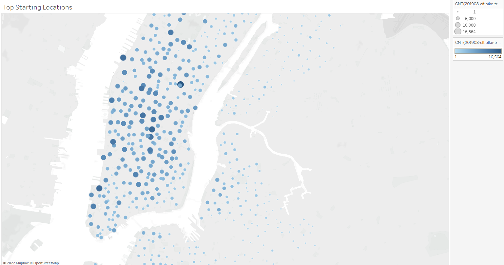
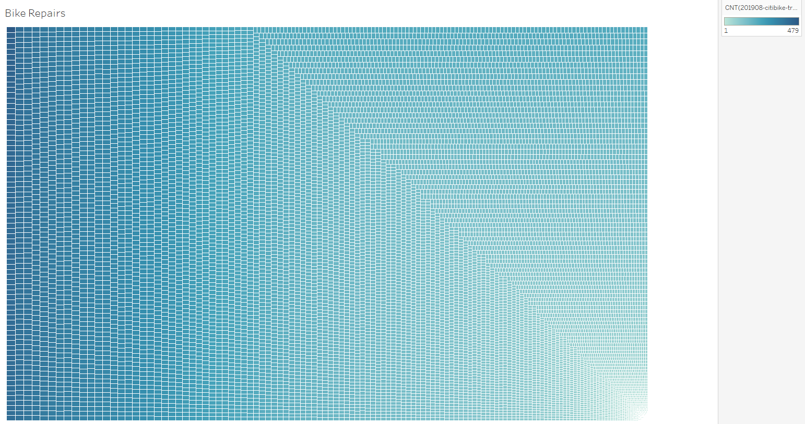
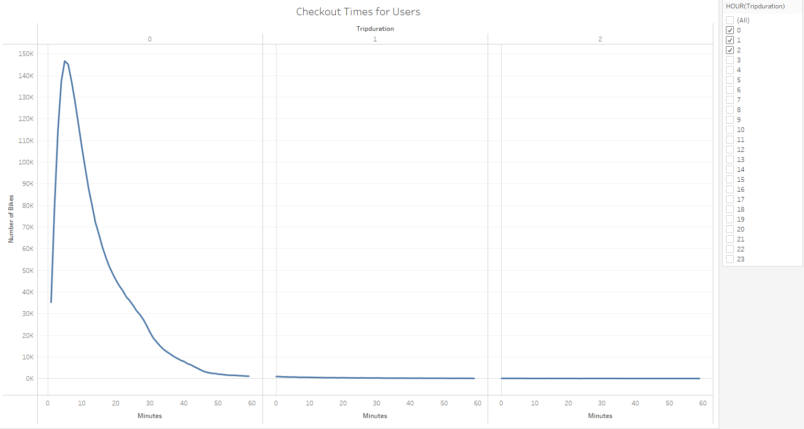
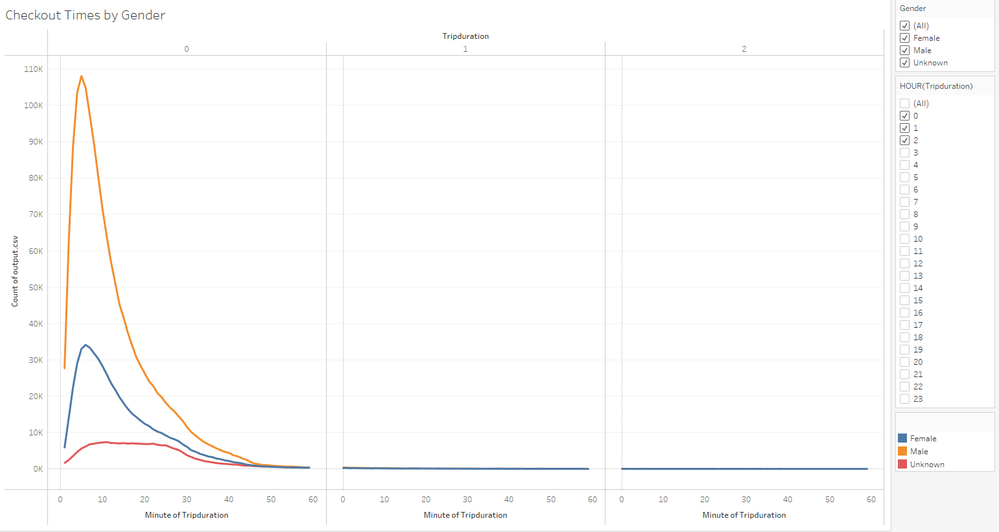
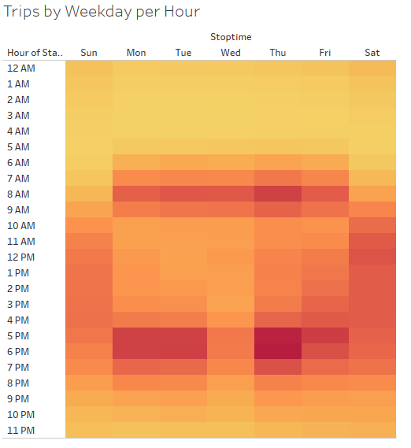
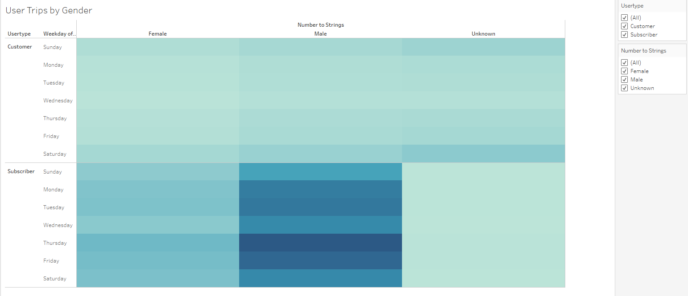
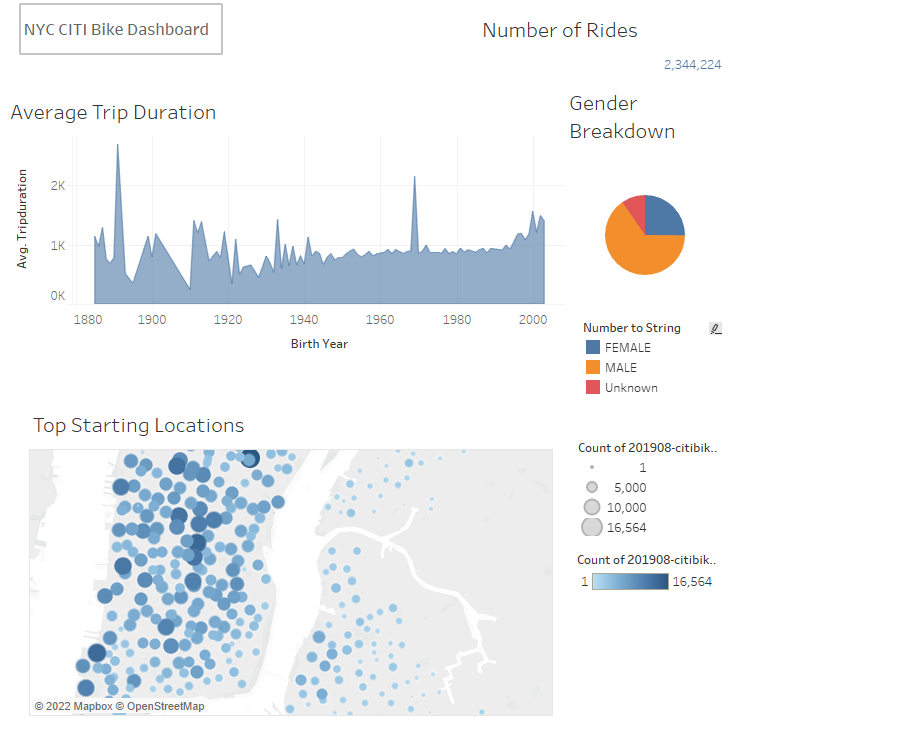

# Bikesharing
## Overview of Project
> This project had a goal of analysis and visulization of it's process. Before we've started we had the 2019, August bike riding data as csv file, which gave us the tripdurations, start and stoptime with locations, Gender distrubition and customer types. Analysis based on those data and creating a charts, graphs to visually see the key points and main user types and hours. 
## Results
### Methodology
> To achieve our goals we've used Jupyter Notebook to make some changes on the datatypes. Main part of project was done by Tableau. 
### Resources and Outcomes
* First we look up to the common locations. Following image shows us its distribution through the map. 
> 
* Secondly we've checked the bike repairs, the longer its use the quicker required the repair.
> 
* Then we checked the chekcout times by the users and by the gender. This gave us most common usage of bikes under 30 min trips and mostly male users are tend to ride it rather than Female and Unknown genders.
>  
> 
* After we checked trips was done by gender and among the hours during the weekday. We've also add filters to see desired outputs.
> 
> 
* Finally before creating our Dashboard we've look up to the trips by gender among the weekdays and see subscribed or daily customers usage.
> 
* This following image is the Dashboard created for presentation of our analysis.
> 

## Summary
